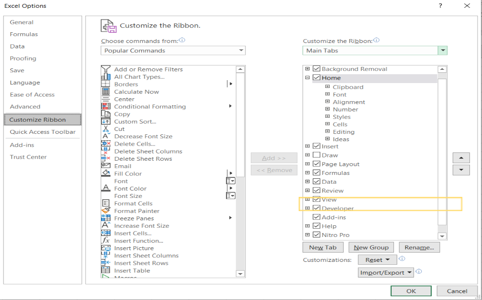
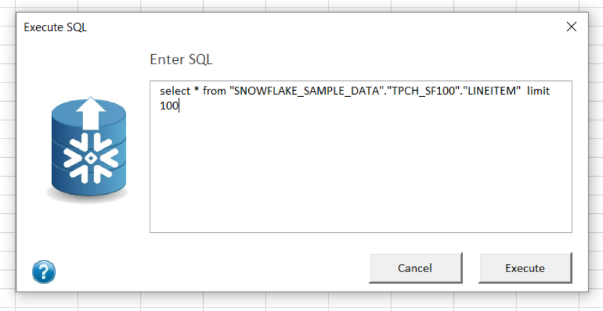
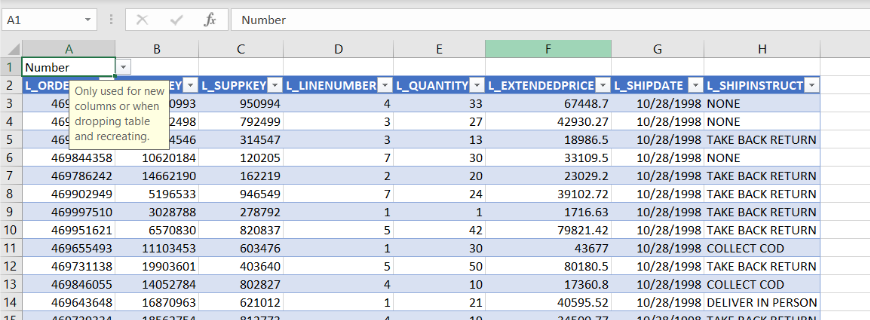

# Excelerator: Use Snowflake in Excel

Excelerator is an Excel plugin to help you flow data in and out of Snowflake using Excel.

Example use-cases include:
* financial budgeting write-back,
* look-up table maintenance,
* pricing analysis,
* and more!

| :memo: LEGAL              |
|:---------------------------|
|Excelerator is not a supported product by Snowflake or any company. Excelerator will write data to the Snowflake database and should be used with great care. Use at your own risk. |

## Get Started with Excelerator

To get started, you'll need to:

1. Install the plugin in Excel (below)
2. [Connect your Snowflake account](#use-excelerator)
3. Then you can [query Snowflake](#execute-a-query) and optionally [write data back](#write-data-to-snowflake)

## Install Excelerator

To begin, clone or download this repository to get your own copy of all the files.
    
### Step 1 (optional): Create Stored Procedures in Snowflake

This step is only needed to enable the ‘Data Type Auto-generation’ feature when adding a new table or column. Without the stored procedures, you'll have to define the data types for each new column.

If you have access to the Snowflake web interface and a role with elevated privileges such as "ACCOUNTADMIN", you can run `SnowFlow_Stored_Procedures.sql`.  If you don't have access, then contact your Snowflake DBA and have them run the script for you.  This script will need to be run in the same database that you login into with the Excel Addin, which we discuss below.

### Step 2: Set Required Privileges

Below are the privileges required for each capability.

To **query** data:
| **Object** | **Privilege**        |
|------------|----------------------|
| Database   | USAGE                |
| Schema     | USAGE, CREATE STAGE* |
| Table      | SELECT               |

\*Stage can be provided in the login instead

To **upload** data requires everything in query, plus:

| **Object** | **Privilege**            |
|------------|--------------------------|
| Schema     | CREATE TABLE             |
| Table      | INSERT, UPDATE, TRUNCATE |

To **rollback** data requires the schema privileges from upload, plus:

| **Object** | **Privilege** |
|------------|---------------|
| Table      | Ownership     |
  
    
For advanced features: Auto-generate Data Types

* usage on all procedures
* usage on future procedures
* usage on all functions
* usage on future functions

One approach for handling these privileges is to create a new role with the above Schema and Database privileges and assigned that role existing role with the Table level privileges.

`SnowFlow_Create_Role.sql` is provided to create this role and assigns the role to a parent role.

You’ll have to update the script before executing it with the information specific to your environment. In the script, you will be providing the parent role. Then you'll use the parent role when logging in.

### Step 3 – Install Excel Add-in

In order to install the plugin, which Excel calls "add-ins," make sure you have access to the "Developer" tab within Excel's menu.  You can add it by right-clicking on the toolbar, selecting “customize the ribbon", and then clicking its checkbox.

Now select Excel Add-Ins:

Navigate to the directory where the `.xlam` file was saved.  Make sure to check the plugin before selecting OK.

At this point, Excelerator is available within Excel. You'll see a UI within the "Home" tab.

## Use Excelerator

With Excelerator installed, now you need to connect it to Snowflake. 

First, confirm you can find the appropriate buttons within the "Home" tab.

### Connection Parameters

Click the `connect` button and enter your Snowflake connection information.  There are two security types standard: login/password and SSO.  We recommend using SSO for more secure authentication.

In the `Role` field, add the role that you entered into the script in Step 3.

| :exclamation:        | The login database and schema specified in the connection must be the same database and schema the Stored Procs were run under     |
|---------------|:------------------------|

### Execute a Query

Now we'll walk you through each section of the plugin. You can work with data sourced from other data sources within Excel (such as files) or you can pull data from Snowflake into Excel.  You can manipulate the data using VBA scripts and vlookups, but be sure to write that final data is sent back to Snowflake! The plugin handles both reading and writing scenarios.

Pull data into Excel by selecting the “Query button” and typing in the query.

You'll get results that look similar to this:

Repeat as-needed to gather data from Snowflake into your Excel sheet.

### Write Data to Snowflake

Once the data is returned you can update or insert rows and columns within Excel.

To propagate those changes to Snowflake press the “Upload” button.  Here you can enter the worksheet the data is being sourced from and define the table the data is being written to.

Another important option is defining the columns that will represent the keys in order to do the update logic needed if the user updates or adds a new column in the Excel sheet.  This can be done by entering the column position ex. A,B,C.  So the first 3 columns in the excel sheet and target table will be the key

If you decide the current structure is incorrect and want to just recreate and load the data, you can do so by truncating all the data.

When you add a new table or column to the sheet, the last checkbox starting with "Auto-generate" will allow the system to automatically create the column data types.  
However, there may be times where you want to explicitly define the data types within the Excel sheet before uploading the data. Press the “Define data type” button in the Excel Ribbon and a data type selector will appear above the column header.

| :wrench: Known Issues              |
|:---------------------------|
| Timestamps don’t handle anything less than seconds. To get around this, manually cast the time to a varchar in the SQL. |

