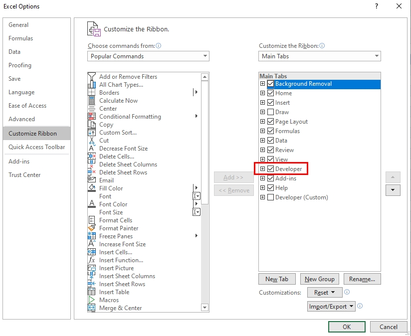
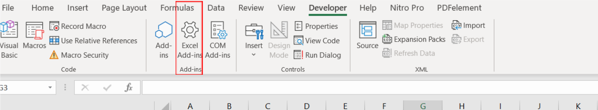
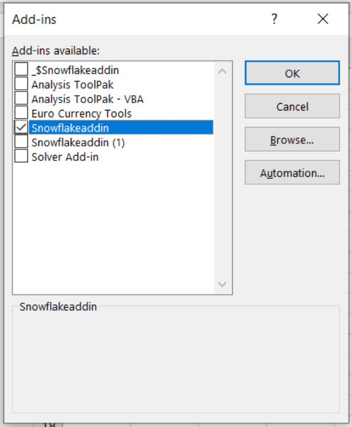
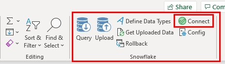
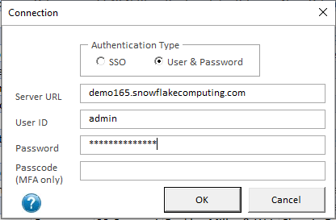
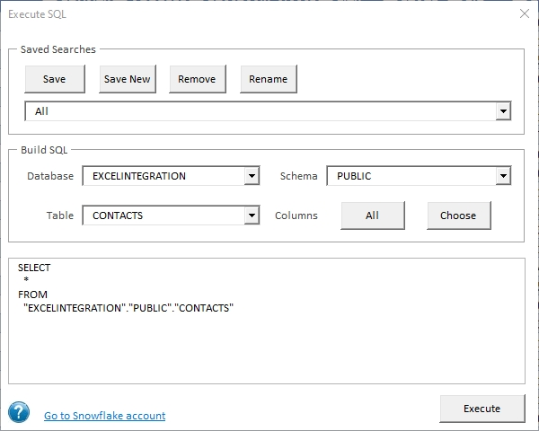
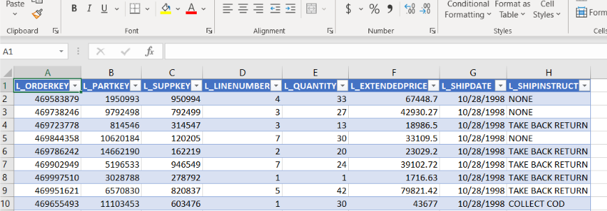
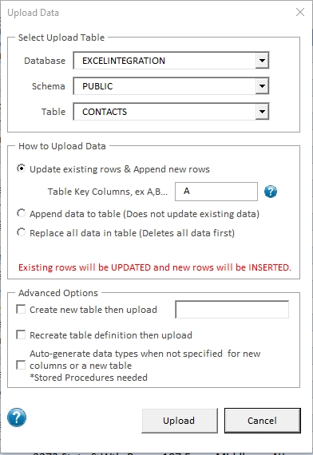

# Excelerator: Use Snowflake in Excel

Excelerator is an Excel plugin to help you flow data in and out of Snowflake using Excel.

Example use-cases include:
* financial budgeting write-back,
* look-up table maintenance,
* pricing analysis,
* and more!

| :memo: LEGAL              |
|:---------------------------|
|Excelerator is not a supported product by Snowflake or any company. Excelerator will write data to the Snowflake database and should be used with great care. Use at your own risk. |

## Get Started with Excelerator

To get started, you'll need to:

1. Install the plugin in Excel (below)
2. [Connect your Snowflake account](#use-excelerator)
3. [Query Snowflake](#execute-a-query) and optionally [write data back](#write-data-to-snowflake)

## Install Excelerator

To begin, clone or download this repository to get your own copy of all the files.
    
### Step 1 (optional): Create Stored Procedures in Snowflake

This step is only needed to enable the "Data Type Auto-generation" feature when adding a new table or column. Without the stored procedures, you'll have to define the data types for each new column.

If you have access to the Snowflake web interface and a role with elevated privileges such as "ACCOUNTADMIN", you can run `SnowflakeExcelAddin_Stored_Procedures.sql`.  If you don't have access, then contact your Snowflake DBA and have them run the script for you.  This script will need to be run in the same database that you login into with the Excel Addin, which we discuss below.

### Step 2: Set Required Privileges

Below are the privileges required for each capability.

To **query** data:
| **Object** | **Privilege**        |
|------------|----------------------|
| Database   | USAGE                |
| Schema     | USAGE, CREATE STAGE* |
| Table      | SELECT               |

\*Stage can be provided in the login instead

To **upload** data requires everything in query, plus:

| **Object** | **Privilege**            |
|------------|--------------------------|
| Schema     | CREATE TABLE             |
| Table      | INSERT, UPDATE, TRUNCATE |

To **rollback** data requires the schema privileges from upload, plus:

| **Object** | **Privilege** |
|------------|---------------|
| Table      | Ownership     |
  
    
For advanced features: Auto-generate Data Types

* usage on all procedures
* usage on future procedures
* usage on all functions
* usage on future functions

One approach for handling these privileges is to create a new role with the above Schema and Database privileges and assigned that role existing role with the Table level privileges.

`SnowflakeExcelAddin_Create_Role.sql` is provided to create this role and assigns the role to a parent role.

You’ll have to update the script before executing it with the information specific to your environment. In the script, you will be providing the parent role. Then you'll use the parent role when logging in.

### Step 3 – Install Excel Add-in

There are 2 versions of the Excel Add-in, one for only reading data from Snowflake and one for reading and writing data to snowflake. The Excel Add-ins are Excel files with an extenstion of ".xlam". The .xlam file for the read-only version is called "SnowflakeExcelAddinReadOnly.xlam". The full read-write version is called "SnowflakeExcelAddin.xlam". These files are both stored in the repository. In order to install theseadd-ins, make sure you have access to the "Developer" tab within Excel's menu. If you son't have the "Developer" tab, you can add it by right-clicking on the toolbar, selecting “customize the ribbon", and then clicking its checkbox.

From the Developer menu, select "Excel Add-Ins":

Navigate to the directory where the ".xlam" files were saved and select the one you want to install.  Make sure to check the plugin before selecting OK.

At this point, Excelerator is available within Excel. You'll see a UI within the "Home" tab.

## Use Excelerator

With Excelerator installed, now you need to connect it to Snowflake. 

First, confirm you can find the appropriate buttons within the "Home" tab.

### Connection Parameters

Click the `connect` button and enter your Snowflake connection information.  There are two security types standard: login/password and SSO.  We recommend using SSO for more secure authentication.

In the `Role` field, add the role that you entered into the script in Step 3.

| :exclamation:        | The login database and schema specified in the connection must be the same database and schema the Stored Procs were run under     |
|---------------|:------------------------|

### Overview

Now we'll walk you through each section of the plugin. You can work with data sourced from other data sources within Excel (such as files) or you can pull data from Snowflake into Excel.  You can manipulate the data using VBA scripts and vlookups, but be sure to write that final data back to Snowflake! The plugin handles both reading and writing scenarios.

### Execute a Query
Pull data into Excel by selecting the “Query" button. 
A search dialog will open that allows you to select a database, schema and table in order to download data. Once you select a table you can then choose which columns you would like to reutrn from the selected table. You can select all the columns by clicking the "All" button, or select a subset of columns by clicking the "Choose" button. Once selected, a SQL statement is created and entered in the buttom text area. This SQL statement can be manually updated.
Click the "Execute" button to execute the query in Snowflake and pull down the result set.

You'll get results that look similar to this:

Repeat as-needed to gather data from Snowflake into your Excel sheet.

### Write Data to Snowflake

To write data to Snowflake, click the "Upload" button in the ribbon.

#### Select Upload Table
In the top section, choose the database, schema and table to upload the data to.

##### Basic Upload section
There are 3 basic ways to upload data into a table:
* Update existing rows & Append new rows 
* Append data - This will insert all the data into the table.
* Replace all data in the table with the data from the spreadhseet - All the data will be deleted from the table and then the new data will be inserted.

When selecting the first option, you will have to define the columns that represent the table key. The key defines how each row is unique, and is used to update existing rows. This can be done by entering the column position, for example: A,B,C.  In this case the first 3 columns in the excel sheet and target table will be the key.

With any of the above options, if a column exists in the spreadsheet, but does not exist in the table, it will be added automotically to the Snowflake table. The data type can be specified by clicking the "Define Data Types" button in the ribbon. If you prefer to have Snowflake determine the data types, select the "Auto-generate data types" in the "Advance Options" section below.

#### "Advanced Options" section 
This section allows more options:
1 - Create a new table - This will create a new table with the columns specified in the first row.
2 - Recreate and existing table - This will drop the table and recreate the table with the columns specified in the first row.

### Auto-generate Data Types 
When creating a new table, recreating a table or adding new columns to an existing table, you have the option to define the data types manually or let Snowflake determine the data type based on the data in the columns. To use this feature, click the "Auto-generate data types" checkbox. In order to use the Auto-generate feature, the Snowflake Excel stored procedures must be installed in the database & schema that was entered in the connection dialog. 
The data type can be manually specified by clicking the "Define Data Types" button in the ribbon. A new row will be created in the first line of the spreadsheet containing a drop down of the Snowflake supported data types. Choose the appropriate data types for each column.

| :wrench: Limitations|
|:---------------------------|
| Timestamps don’t handle anything less than seconds. To get around this, manually cast the time to a varchar in the SQL. |

